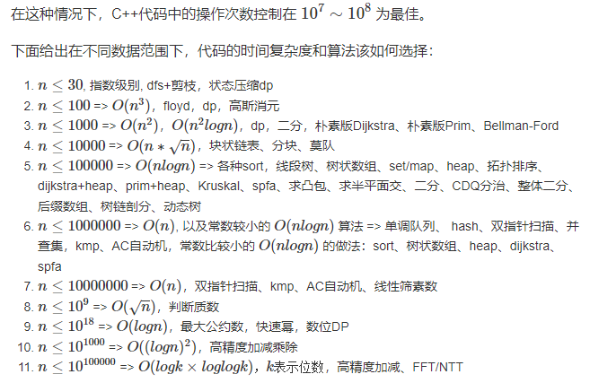
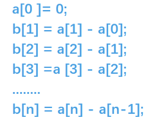

# 格式化输出
#### printf
```cpp
printf("%d\n", 10);  // 整数
printf("%f\n", 1.23);  // 浮点数
printf("%.2f\n", 1.23);  // 保留两位小数
printf("%6d\n", 10);  // 宽度为6
printf("%06d\n", 10);  // 宽度为6, 空余的地方补0
printf("%s\n", "hello");  // 字符串
printf("%c\n", 'c');  // 字符
```

#### iostream
```cpp
#include <iostream>
#include <iomanip>
cout << fixed << setprecision(2) << 1.23 << endl;  // 保留两位小数
cout << setw(6) << 10 << endl;  // 宽度为6
cout << setw(6) << setfill('0') << 10 << endl;  // 宽度为6, 空余的地方补0
cout << dec << 15;//10
cout << hex << 15;//16
cout << oct << 15;//8
cout << left << setw(10) << "Hello";//左对齐
cout << right << setw(10) << "Hello";//右对齐
```

#### 文件操作
```cpp
#include<fstream>
ifstream input_file("input.txt");  // 通过构造函数打开文件
ofstream output_file;
output_file.open("output.txt");  // 通过.open()函数打开文件


ifstream input_file("input.txt");
int a;
input_file >> a;  // 读取一个整数

char c;
input_file.get(c);  // 读取一个字符

string line;
getline(input_file, line);  // 读取一整行

ofstream output_file("output.txt");
output_file << "Hello, world!\n";  // 写入一个字符串

ifstream input_file("input.txt");
if (!input_file) {
    cerr << "Failed to open the file.\n";
}

input_file.close();
output_file.close();

```

# 01背包
#### 法一：暴搜

1. 一个n位的2进制数，每一位选or不选即可
2. `i>>j&1` 用来判断第j位是否为1，从最低位（第0位开始）
3. `i< 1<<n` 则是遍历一个n为二进制数，0-$2^n$

#### 法二：01背包

1. 要使得花费最小，实则要使sum-x这一段取n本书的总和最大
2. 背包容量为sum-x
3. 每一个物品的体积为a[i]，每一个物品的价值也为a[i]
4. 所以正序遍历物品，逆序循环体积（打板子） （逆序遍历体积是因为在一维背包下，状态的更新取决于前置状态，但是前序状态已经被污染，如果是二维则可以正序遍历体积）


#### 1.二维状态

```cpp
for(int i=1;i<=n;++i)       //遍历物品
    for(int j=1;j<=m;++j){  //遍历体积
        if(j<v[i])
            f[i][j]=f[i-1][j];//拿不了 则第i个状态的价值等价于第i-1个状态
        else
            f[i][j]=max(f[i-1][j],f[i-1][j-v[i]]+w[i]);
    }
```

#### 2.一维状态

1.直接定义 `f[j]` 为n个物品下容量为j的背包的最优解 这样就可以直接决策到第i件物品
2.一定得逆序遍历体积，避免前置状态被污染(若j从小到大，f[j-v[i]]中，由于j-v[i]小于j，f[j-v[i]]已经在i这层循环被计算了，而我们想要的f[j-v[i]]应该是i-1层循环里面的，所以j从大到小的话保证此时的f[j-v[i]]还未被计算，也就是第i-1层的数据)
3.同时我们枚举的背包容量只有在大于`v[i]`的时候才会更新状态，所以我们可以继续优化循环终止的条件

```cpp
for(int i=1;i<=n;++i)
    for(int j=m;j>=v[i];--j)
        f[j]=max(f[j],f[j-v[i]]+w[i]);
```


# 去除连续重复
```cpp
v[i].erase(unique(v[i].begin(), v[i].end()), v[i].end());
```

1.`unique(v[i].begin(), v[i].end())`: `unique`函数接收两个迭代器作为参数，表示操作的范围。在这里，`v[i].begin()`和`v[i].end()`表示对`v[i]`这个`vector`中的所有元素进行去重操作。`unique`函数将连续重复的元素移到`vector`的尾部，并返回一个指向去重后新的尾部的迭代器。
需要注意的是，unique函数只去除**连续重复**的元素，所以在使用`unique`之前，如果需要完全去重，**你需要对vector进行排序**！！！。

`v[i].erase(first, last)`: `erase`函数用于删除`vector`中`[first, last)`范围内的元素。在这里，`first`是`unique`函数返回的迭代器，`last`是`v[i].end()`。这意味着从`unique`函数返回的迭代器指向的位置开始，一直到`vector`的尾部，都是被移动到尾部的重复元素，`erase`函数将这些元素删除。
综上所述，这段代码的作用是去除`v[i]`这个`vector`中的连续重复元素。如果需要完全去除`v[i]`中的所有重复元素，可以在使用`unique`和`erase`函数之前，对`v[i]`进行排序。





# 前缀和

1.定义一个`sum[]`数组，`sum[i]`代表`a`数组中前`i`个数的和。
```cpp
for(int i = 1; i <= n;i++)
{ 
    sum[i] = sum[i - 1] + a[i];   
}
```

2.查询l到r的和

只需要O(1)的时间复杂度即可
```cpp
sum[r]-sum[l-1]
```

# 差分

1.可以直接理解成前缀和的逆运算



2.区间l到r全部加上c
时间复杂度O(1)

**a数组是b数组的前缀和数组**，比如对`b`数组的`b[i]`的修改，会影响到`a`数组中从`a[i]`及往后的每一个数。

```cpp
b[l] += c;     //将序列中[l, r]之间的每个数都加上c
b[r + 1] -= c;

for (int i = 1; i <= n; i++)
{
    a[i] = b[i] + a[i - 1];    //前缀和运算
    printf("%d ", a[i]);
}
```
当然也可以直接
```cpp
for(int i=1;i<N;++i)
    b[i]+=b[i-1];
```
这样得到的就是a数组

# 二维前缀和

```cpp

    for(int i=1;i<=n;++i){
        for(int j=1;j<=n;++j){
            int x;
            cin>>x;
            sum[i][j]=x+sum[i-1][j]+sum[i][j-1]-sum[i-1][j-1];
        }
    }

    for(int i=1;i<=n;++i){
        for(int j=1;j<=n;++j){
            int x1=max(1,i-r),y1=max(1,j-r);
            int x2=min(n,i+r),y2=min(n,j+r);
            int total=sum[x2][y2]+sum[x1-1][y1-1]-sum[x1-1][y2]-sum[x2][y1-1];

            int cnt=(x2-x1+1)*(y2-y1+1)*t;
            if(total<=cnt) ans++;
        }
    }

```

# 排序 运算符重载
```cpp
#include<iostream>
#include<algorithm>
#include<cmath>
using namespace std;


int n,X,Y;
const int N=205;
typedef struct  Point
{
    int x,y,id;
    int  dis;
    bool operator < (const Point &t){
        if(dis!=t.dis) return dis<t.dis;
        return id<t.id;
    }
}Point;

Point pos[N];

int get_dis(int x,int y,int X,int Y){
    return pow( (x-X),2)+pow((y-Y),2);
}


int main()
{
    cin>>n>>X>>Y;
    for(int i=1;i<=n;++i){
        pos[i].id=i;
        cin>>pos[i].x>>pos[i].y;
        pos[i].dis=get_dis(X,Y,pos[i].x,pos[i].y);
    }
    sort(pos+1,pos+n+1);
    cout<<pos[1].id<<endl<<pos[2].id<<endl<<pos[3].id<<endl;
    system("pause");
    return 0;
}
```

# 状压DP
```cpp
#include<iostream>
#include<iomanip>
using namespace std;
 
double f[16*5+1][1<<16];//[coin][state]
double p[16+1];
int  n,k;

double dp(double depth,int  coin,int  state,double cnt){
    if(f[coin][state]) return f[coin][state];//记忆化搜索
    if(coin>=cnt*k) return depth;//返回搜索的层数
    double s=0;

    //遍历所有的卡
    for(int i=0;i<n;++i){
        if((state>>i)&1)
            s+=p[i]*dp(depth+1,coin+1,state,cnt);
        else
            s+=p[i]*dp(depth+1,coin,state|(1<<i),cnt-1);
    }
    f[coin][state]=s;
    return s;
}

int  main()
{
    cin>>n>>k;
    for(int i=0;i<n;++i)
        cin>>p[i];
    
    cout<<setprecision(11)<<dp(0,0,0,n);
    system("pause");
    return 0;
}
```
# vector

1. `push_back()`：在vector的尾部添加一个新元素。

2. `pop_back()`：移除vector的最后一个元素。

3. `insert()`：在vector的指定位置插入一个或多个元素。

4. `erase()`：删除vector的指定位置或指定范围的元素。

5. `clear()`：清空vector中的所有元素。

6. `size()`：返回vector中元素的数量。

7. `empty()`：检查vector是否为空。

8. `resize()`：更改vector的大小。

9. `capacity()`：返回vector当前的容量。

10. `operator[]`：返回指定位置的元素的引用。

11. `at()`：返回指定位置的元素的引用。


**增**（添加元素）

```cpp
vector<int> vec;
vec.push_back(1);  // 添加一个元素到尾部
vec.insert(vec.begin(), 0);  // 在指定位置插入元素
```

**删**（删除元素）

```cpp
vector<int> vec = {0, 1, 2, 3, 4};
vec.pop_back();  // 删除尾部元素
vec.erase(vec.begin());  // 删除指定位置元素
vec.clear();  // 清空所有元素
```

**改**（修改元素）

```cpp
vector<int> vec = {0, 1, 2, 3, 4};
vec[0] = 5;  // 使用下标修改元素
vec.at(1) = 6;  // 使用at函数修改元素
```

**查**（访问元素）

```cpp
vector<int> vec = {0, 1, 2, 3, 4};
int first_element = vec[0];  // 使用下标访问元素
int second_element = vec.at(1);  // 使用at函数访问元素
```

请注意，`at()`函数和`operator[]`在访问超出范围的元素时，行为不同。`at()`函数将抛出一个`out_of_range`异常，而`operator[]`没有定义超出范围的行为，可能会导致未定义的行为。


**1. 使用经典的for循环**

```cpp
vector<int> vec = {0, 1, 2, 3, 4};
for (size_t i = 0; i < vec.size(); ++i) {
    cout << vec[i] << endl;
}
```

**2. 使用迭代器**

```cpp
vector<int> vec = {0, 1, 2, 3, 4};
for (auto it = vec.begin(); it != vec.end(); ++it) {
    cout << *it << endl;
}
```


# set
    按特定的顺序排列。每个元素在set中必须是唯一的，因为元素的值定义了其在set中的位置。set通常是用红黑树实现的，所以查找，插入和删除的时间复杂度都是对数复杂度。默认按照升序排序，如果你想创建一个元素按降序排列的std::set，你可以这样做：
 ```cpp
set<int, greater<int>> s;
```


1. `insert()`：插入元素。

2. `erase()`：删除指定的元素或者范围内的元素。

3. `clear()`：清除所有元素。

4. `size()`：返回set中的元素个数。

5. `empty()`：检查set是否为空。

6. `begin()`、`end()`：返回指向set开始和结束位置的迭代器。

7. `find()`：查找指定元素的位置。

8. `count()`：返回指定元素的数量（在set中该函数的返回值要么是0要么是1，因为set中元素唯一）。

以下是这些函数在增删改查操作中的应用：

**增**（添加元素）

```cpp
set<int> s;
s.insert(1);  // 插入元素
```

**删**（删除元素）

```cpp
set<int> s = {0, 1, 2, 3, 4};
s.erase(1);  // 删除元素1
s.erase(s.begin(), s.end());  // 删除所有元素，等价于s.clear();
```

**查**（查找元素）

```cpp
set<int> s = {0, 1, 2, 3, 4};
auto it = s.find(1);  // 查找元素1，返回指向元素1的迭代器，如果没有找到则返回s.end()
if (s.count(1) > 0) { // 检查元素1是否存在
    // do something
}
```

**改**（修改元素）

需要注意的是，`set`中的元素是常量，不能直接被修改。如果需要修改set中的元素，一般的做法是删除旧的元素然后插入新的元素。

**遍历**（访问元素）

```cpp
set<int> s = {0, 1, 2, 3, 4};
//使用迭代器遍历
for (auto it = s.begin(); it != s.end(); ++it) {
    cout << *it << endl;
}
```

# unordered_set

让我们讨论`unordered_set`。`unordered_set`是一个关联容器，它包含唯一元素的集合。搜索、插入和删除的平均时间复杂度为常数时间。`unordered_set`使用散列函数来确定元素在容器内部的位置。不像`set`，`unordered_set`内部的元素不会按任何顺序排序，而是组织在存储桶中。

以下是`unordered_set`的一些常用函数：

1. `insert()`：插入元素。

2. `erase()`：删除指定的元素或者范围内的元素。

3. `clear()`：清除所有元素。

4. `size()`：返回集合中的元素个数。

5. `empty()`：检查集合是否为空。

6. `begin()`、`end()`：返回指向集合开始和结束位置的迭代器。

7. `find()`：查找指定元素的位置。

8. `count()`：返回指定元素的数量（在unordered_set中该函数的返回值要么是0要么是1，因为集合中元素唯一）。

以下是这些函数在增删改查操作中的应用：

**增**（添加元素）

```cpp
unordered_set<int> s;
s.insert(1);  // 插入元素
```

**删**（删除元素）

```cpp
unordered_set<int> s = {0, 1, 2, 3, 4};
s.erase(1);  // 删除元素1
s.clear();  // 删除所有元素
```

**查**（查找元素）

```cpp
unordered_set<int> s = {0, 1, 2, 3, 4};
auto it = s.find(1);  // 查找元素1，返回指向元素1的迭代器，如果没有找到则返回s.end()
if (s.count(1) > 0) { // 检查元素1是否存在
    // do something
}
```

**改**（修改元素）

需要注意的是，`unordered_set`中的元素是常量，不能直接被修改。如果需要修改set中的元素，一般的做法是删除旧的元素然后插入新的元素。

**遍历**（访问元素）

```cpp
unordered_set<int> s = {0, 1, 2, 3, 4};

// 使用迭代器遍历
for (auto it = s.begin(); it != s.end(); ++it) {
    cout << *it << endl;
}
```

# map

`map`是C++的标准库容器，它存储的是键值对（key-value pair），所有的元素都会根据键（key）进行排序，排序的规则可以在创建`map`对象时指定。`map`内部通常使用红黑树实现，所以它的插入，删除和查找的时间复杂度都是对数复杂度。

以下是`map`的一些常用函数：

1. `insert()`：插入元素，元素是键值对。

2. `erase()`：删除指定的元素或者范围内的元素。

3. `clear()`：清除所有元素。

4. `size()`：返回map中的元素个数。

5. `empty()`：检查map是否为空。

6. `begin()`、`end()`：返回指向map开始和结束位置的迭代器。

7. `find()`：查找指定键的元素。

以下是这些函数在增删改查操作中的应用：

**增**（添加元素）

```cpp
map<string, int> m;
m.insert(make_pair("apple", 1));  // 插入元素
m["banana"] = 2;  // 另一种插入元素的方式
```

**删**（删除元素）

```cpp
map<string, int> m = {{"apple", 1}, {"banana", 2}};
m.erase("apple");  // 删除键为"apple"的元素
m.clear();  // 删除所有元素
```

**查**（查找元素）

```cpp
map<string, int> m = {{"apple", 1}, {"banana", 2}};
auto it = m.find("apple");  // 查找键为"apple"的元素，返回一个迭代器，如果没有找到则返回m.end()
if (it != m.end()) {
    // 找到了键为"apple"的元素，it->second是对应的值
}
```

**改**（修改元素）

```cpp
map<string, int> m = {{"apple", 1}, {"banana", 2}};
m["apple"] = 3;  // 修改键为"apple"的元素的值
```

**遍历**（访问元素）

```cpp
map<string, int> m = {{"apple", 1}, {"banana", 2}};
// 使用迭代器遍历
for (auto it = m.begin(); it != m.end(); ++it) {
    cout << it->first << ": " << it->second << endl;
}
```

在上述代码中，`cout << pair.first << ": " << pair.second << endl;`是对每个元素执行的操作，你可以将其替换为你需要的操作。

# unordered_map

`unordered_map`是C++的标准库容器，它存储的是键值对（key-value pair），所有的元素都存储在一个无序的哈希表中。`unordered_map`的查找，插入，删除的平均时间复杂度都是常数时间，但是在最坏的情况下，这些操作的时间复杂度可以是线性的。

以下是`unordered_map`的一些常用函数：

1. `insert()`：插入元素，元素是键值对。

2. `erase()`：删除指定的元素或者范围内的元素。

3. `clear()`：清除所有元素。

4. `size()`：返回unordered_map中的元素个数。

5. `empty()`：检查unordered_map是否为空。

6. `begin()`、`end()`：返回指向unordered_map开始和结束位置的迭代器。

7. `find()`：查找指定键的元素。

以下是这些函数在增删改查操作中的应用：

**增**（添加元素）

```cpp
unordered_map<string, int> m;
m.insert(make_pair("apple", 1));  // 插入元素
m["banana"] = 2;  // 另一种插入元素的方式
```

**删**（删除元素）

```cpp
unordered_map<string, int> m = {{"apple", 1}, {"banana", 2}};
m.erase("apple");  // 删除键为"apple"的元素
m.clear();  // 删除所有元素
```

**查**（查找元素）

```cpp
unordered_map<string, int> m = {{"apple", 1}, {"banana", 2}};
auto it = m.find("apple");  // 查找键为"apple"的元素，返回一个迭代器，如果没有找到则返回m.end()
if (it != m.end()) {
    // 找到了键为"apple"的元素，it->second是对应的值
}
```

**改**（修改元素）

```cpp
unordered_map<string, int> m = {{"apple", 1}, {"banana", 2}};
m["apple"] = 3;  // 修改键为"apple"的元素的值
```

**遍历**（访问元素）

```cpp
unordered_map<string, int> m = {{"apple", 1}, {"banana", 2}};
for (const auto& pair : m) {
    cout << pair.first << ": " << pair.second << endl;
}
// 或者使用迭代器遍历
for (auto it = m.begin(); it != m.end(); ++it) {
    cout << it->first << ": " << it->second << endl;
}
```

在上述代码中，`cout << pair.first << ": " << pair.second << endl;`是对每个元素执行的操作，你可以将其替换为你需要的操作。

# queue

`queue`是一个容器适配器，用于给容器提供队列（FIFO，先进先出）的特性。具有队列特性的意思是，元素的插入只能在队列的一端（称为队尾），而删除只能在另一端（称为队头）。

以下是`queue`的一些常用函数：

1. `push()`：向队列尾部添加元素。

2. `pop()`：删除队列头部的元素。

3. `front()`：返回队列头部的元素。

4. `back()`：返回队列尾部的元素。

5. `empty()`：检查队列是否为空。

6. `size()`：返回队列中的元素个数。

以下是这些函数在增删改查操作中的应用：

**增**（添加元素）

```cpp
queue<int> q;
q.push(1);  // 在队列尾部添加元素
```

**删**（删除元素）

```cpp
queue<int> q;
q.push(1);
q.push(2);
q.pop();  // 删除队列头部的元素
```

**查**（查找元素）

```cpp
queue<int> q;
q.push(1);
q.push(2);
int front = q.front();  // 获取队列头部的元素
int back = q.back();  // 获取队列尾部的元素
```

在队列中没有直接的修改元素的操作，如果你需要修改队头或队尾的元素，可以先使用`front()`或`back()`获取到元素的引用，然后直接修改引用的值。但是，通常我们不会这么做，因为这违反了队列的先进先出的原则。

遍历`queue`并不像其他容器那样常见，因为队列的设计初衷是只能从两端进行操作。然而，如果你真的需要遍历一个队列，可以这么做：

```cpp
queue<int> q;
// 先将元素添加到队列中
q.push(1);
q.push(2);
q.push(3);
// 然后遍历队列
queue<int> qcopy = q;  // 创建一个队列的副本进行遍历
while(!qcopy.empty()){
    cout << qcopy.front() << endl;
    qcopy.pop();
}
```

在这个代码中，我们创建了一个队列的副本进行遍历，这样原始队列的元素不会被删除。注意，在遍历过程中，我们不能修改队列中的元素。

# string

`string` 是C++标准库中的一个类，用于表示和操作字符串。它比C风格的字符串更易于使用和更安全。

以下是 `string` 的一些常用函数：

1. `size()`/`length()`：返回字符串的长度。

2. `empty()`：检查字符串是否为空。

3. `clear()`：清除字符串中的所有字符。

4. `at()`：返回字符串中指定位置的字符。

5. `substr()`：返回字符串的一个子串。

6. `find()`：在字符串中查找子串或字符。

7. `replace()`：替换字符串的一部分为其他字符串。

8. `append()`：在字符串的末尾添加字符或字符串。

9. `insert()`：在字符串的指定位置插入字符或字符串。

以下是这些函数在增删改查操作中的应用：

**增**（添加元素）

```cpp
string str = "apple";
str.append(" banana");  // 在字符串的末尾添加字符串
str.insert(5, " and");  // 在指定位置插入字符串
```

**删**（删除元素）

```cpp
string str = "apple and banana";
str.erase(5, 5);  // 删除从位置5开始的5个字符
str.clear();  // 删除所有字符
```

**查**（查找元素）

```cpp
string str = "apple and banana";
size_t pos = str.find("banana");  // 查找"banana"在字符串中的位置
if (pos != string::npos) {
    // 找到了"banana"
}
```

**改**（修改元素）

```cpp
string str = "apple and banana";
str.replace(6, 3, "or");  // 将从位置6开始的3个字符替换为"or"
```

**遍历**（访问元素）

```cpp
string str = "apple";
for (char c : str) {
    cout << c << endl;
}
// 或者使用迭代器遍历
for (auto it = str.begin(); it != str.end(); ++it) {
    cout << *it << endl;
}
```
# stack

`stack` 是一个容器适配器，用于给容器提供栈（FILO，先进后出）的特性。具有栈特性的意思是，元素的插入和删除只能在栈的顶部进行。

以下是`stack`的一些常用函数：

1. `push()`：向栈顶添加元素。

2. `pop()`：删除栈顶的元素。

3. `top()`：返回栈顶的元素。

4. `empty()`：检查栈是否为空。

5. `size()`：返回栈中的元素个数。

以下是这些函数在增删改查操作中的应用：

**增**（添加元素）

```cpp
stack<int> s;
s.push(1);  // 在栈顶添加元素
```

**删**（删除元素）

```cpp
stack<int> s;
s.push(1);
s.push(2);
s.pop();  // 删除栈顶的元素
```

**查**（查找元素）

```cpp
stack<int> s;
s.push(1);
s.push(2);
int top = s.top();  // 获取栈顶的元素
```

在栈中没有直接的修改元素的操作，如果你需要修改栈顶的元素，可以先使用`top()`获取到元素的引用，然后直接修改引用的值。但是，通常我们不会这么做，因为这违反了栈的先进后出的原则。

遍历`stack`并不像其他容器那样常见，因为栈的设计初衷是只能从顶部进行操作。然而，如果你真的需要遍历一个栈，可以这么做：

```cpp
stack<int> s;
// 先将元素添加到栈中
s.push(1);
s.push(2);
s.push(3);
// 然后遍历栈
stack<int> scopy = s;  // 创建一个栈的副本进行遍历
while(!scopy.empty()){
    cout << scopy.top() << endl;
    scopy.pop();
}
```

在这个代码中，我们创建了一个栈的副本进行遍历，这样原始栈的元素不会被删除。注意，在遍历过程中，我们不能修改栈中的元素。

# list
`list` 是一个双向链表容器，能够高效地进行插入和删除元素的操作。

以下是 `list` 的一些常用函数：

1. `push_back()`：在列表的末尾添加一个元素。

2. `push_front()`：在列表的开头添加一个元素。

3. `pop_back()`：删除列表的最后一个元素。

4. `pop_front()`：删除列表的第一个元素。

5. `insert()`：在指定位置插入一个元素。

6. `erase()`：删除指定位置的元素。

7. `size()`：返回列表中的元素个数。

8. `empty()`：检查列表是否为空。

9. `remove()`：从列表中移除所有等于给定值的元素。

10. `sort()`：排序列表中的元素。

以下是这些函数在增删改查操作中的应用：

**增**（添加元素）

```cpp
list<int> lst;
lst.push_back(1);  // 在列表的末尾添加一个元素
lst.push_front(2);  // 在列表的开头添加一个元素
lst.insert(lst.begin(), 3);  // 在指定位置插入一个元素
```

**删**（删除元素）

```cpp
list<int> lst;
lst.push_back(1);
lst.push_back(2);
lst.pop_back();  // 删除列表的最后一个元素
lst.pop_front();  // 删除列表的第一个元素
lst.erase(lst.begin());  // 删除指定位置的元素
lst.remove(1);  // 从列表中移除所有等于给定值的元素
```

**查**（查找元素）

在 `list` 中，没有直接获取元素的函数，我们通常需要通过迭代器来访问元素。

```cpp
list<int> lst;
lst.push_back(1);
lst.push_back(2);
for (auto it = lst.begin(); it != lst.end(); ++it) {
    if (*it == 2) {
        // 找到了元素2
    }
}
```

**改**（修改元素）

在 `list` 中，我们可以通过迭代器来修改元素。

```cpp
list<int> lst;
lst.push_back(1);
*lst.begin() = 2;  // 修改第一个元素的值为2
```

**遍历**（访问元素）

```cpp
list<int> lst;
lst.push_back(1);
lst.push_back(2);
for (auto it = lst.begin(); it != lst.end(); ++it) {
    cout << *it << endl;
}
// 或者使用 C++11 的范围基础 for 循环
for (const auto& elem : lst) {
    cout << elem << endl;
}
```

在上述代码中，`cout << *it << endl;` 和 `cout << elem << endl;` 是对每个元素执行的操作，你可以将其替换为你需要的操作。


 # algorithm

C++ 标准库中的 `<algorithm>` 头文件包含一系列在各种数据结构上进行操作的函数模板。以下是 `<algorithm>` 中一些常用函数的简单概述：

1. `sort(begin, end)`: 对序列进行排序。

2. `stable_sort(begin, end)`: 对序列进行稳定排序，保持等价元素的相对顺序。

3. `partial_sort(begin, middle, end)`: 对序列的前N个元素进行排序。

4. `nth_element(begin, nth, end)`: 对序列进行部分排序，使得 nth 位置的元素位于排序后应该在的位置，其左侧的元素不大于它，其右侧的元素不小于它。

5. `binary_search(begin, end, value)`: 在排序序列中进行二分查找。

6. `lower_bound(begin, end, value)`: 返回指向首个不小于给定值的元素的迭代器。

7. `upper_bound(begin, end, value)`: 返回指向首个大于给定值的元素的迭代器。

8. `equal_range(begin, end, value)`: 返回等于给定值的元素的范围。

9. `merge(begin1, end1, begin2, end2, dest)`: 合并两个有序序列。

10. `find(begin, end, value)`: 在序列中查找等于给定值的元素。

11. `find_if(begin, end, predicate)`: 在序列中查找满足谓词的第一个元素。

12. `count(begin, end, value)`: 计算序列中等于给定值的元素的数量。

13. `count_if(begin, end, predicate)`: 计算序列中满足谓词的元素的数量。

14. `replace(begin, end, old_value, new_value)`: 将序列中所有等于 old_value 的元素替换为 new_value。

15. `replace_if(begin, end, predicate, new_value)`: 将序列中所有满足谓词的元素替换为 new_value。

16. `remove(begin, end, value)`: 移除序列中所有等于给定值的元素。

17. `remove_if(begin, end, predicate)`: 移除序列中所有满足谓词的元素。

18. `unique(begin, end)`: 移除序列中所有相邻重复元素。

19. `reverse(begin, end)`: 将序列中的元素反转。

20. `random_shuffle(begin, end)`: 对序列中的元素进行随机重排。

以上所有函数中，`begin` 和 `end` 是序列的起始和结束迭代器，`value` 是需要查找、计数、替换或移除的值，`predicate` 是一个一元函数，用于测试元素是否满足某个条件。注意，部分函数需要输入序列是

有序的，否则结果未定义。
